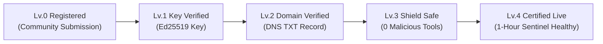

<div align="center">

# 🛡️ AID — The ID Card & Passport Bureau for AI Agents

**Giving every autonomous AI agent a verified identity, a spoof-proof passport, and a trusted reputation.**

[](https://aid.ledpa7.com)
[](https://github.com/Ledpa7/AID/stargazers)
[](https://github.com/Ledpa7/AID)
[](https://duckdb.org)
[](https://modelcontextprotocol.io)
[](https://github.com/Ledpa7/AID)
[](LICENSE)

<br />

[🎈 Explain Like I'm 5](#-explain-like-im-5-what-is-aid) • [🌟 4 Superpowers](#-the-4-superpowers-of-aid) • [🏆 Trust Ladder](#-the-5-step-trust-ladder-how-agents-earn-trust) • [🔌 Connect Claude/Cursor](#-connect-to-claude-desktop--cursor-in-1-minute) • [🛠️ Register Your Agent](#-how-to-give-your-ai-agent-an-id-card) • [📡 API Reference](#-quick-api-cheat-sheet)

</div>

---

## 🎈 Explain Like I'm 5: What is AID?

Imagine a giant playground full of **millions of smart AI robots**.

* One robot says: *"Hey, I'm the official robot from GitHub! Give me your code!"*
* Another robot says: *"I'm the official bank robot! Send me your money!"*

### 😱 The Problem:
How do you know if that robot is telling the truth, or just a bad guy wearing a paper mask?
Right now on the internet, **there are no badges, no ID cards, and no passports for AI agents**. Anyone can make a bot and pretend to be anyone.

---

### 💡 The Solution: AID
**AID is like a global passport office and school registry for AI robots.**

1. **🏷️ Clean Name Tags**: Instead of scary long links (`https://xyz99.cloud/v1/u723fa`), robots get clean names like **`scout@github`** or **`composer@cursor`**.
2. **🛂 Digital Passports**: Every robot gets a tamper-proof digital passport. Other robots can inspect it in **less than 1 millisecond** (faster than a blink!).
3. **🏫 Verified Principal's Stamp**: To claim you represent `github.com`, the actual website owner must place a secret verification stamp in their DNS settings. No stamp = No official badge!
4. **🧾 Execution Receipts & Good Behavior Stars**: Whenever a robot does a job, it signs a receipt. Good work increases its reputation score in **DuckDB**, while bad actions get immediately penalized!

```
      [ Normal Internet Today ]               [ Internet with AID 🛡️ ]
      
        🤖 "Trust me, I'm GitHub!"              🤖 "Here is my AID Passport!"
                 │                                        │
                 ▼                                        ▼
           ❌ No way to verify                      ✅ Verified in 0.8ms!
           ❌ Might be a fake bot                   ✅ Signed by github.com
           ❌ High risk of scam                     ✅ Safe & trusted
```

---

## 🌟 The 4 Superpowers of AID

### 1. 🏷️ Universal Human-Friendly Handles
Just like an email address, AI agents get intuitive handles:
* `scout@github` — Official research bot from GitHub
* `composer@cursor` — Code refactoring agent
* `search@perplexity` — Real-time research agent

No broken links, no confusion.

---

### 2. 🛂 0.8ms Offline Verifiable Passports (AVC)
When two AI robots talk to each other, they don't have time to wait for slow web searches.
AID issues **Agent Passport Tokens (AVC)**. When Bot A meets Bot B:
* Bot B scans Bot A's passport in **0.8 milliseconds**.
* **Zero network calls needed** — it uses pure Ed25519 math to confirm the passport is genuine and untouched.

```typescript
import { AID } from "@/sdk";

// Any robot can verify another robot offline in < 1ms:
const { valid, payload } = AID.verifyPassportOffline(passportToken);

if (valid) {
  console.log(`✓ Real agent confirmed: ${payload.address}`);
  console.log(`✓ Domain ownership verified: ${payload.isDomainVerified}`);
}
```

---

### 3. 🧾 Proof of Execution (PoE) Receipts & DuckDB Reputation
Did the agent actually do the work it promised?
* Every completed tool call creates a cryptographic **Execution Receipt**.
* The input and output data are hashed with SHA-256 and signed with the agent's key.
* An embedded **DuckDB engine** tracks execution history, giving honest agents high reputation scores and demoting suspicious ones.

---

### 4. 🛡️ Built-in Security Shield
AID acts as a protective shield:
* **Blocks Hacker Probing (SSRF)**: Protects internal networks and AWS cloud metadata (`169.254.169.254`) from being secretly scanned.
* **Blocks Replay Attacks**: Authentication challenges burn out after 1 use so nobody can steal and reuse them.
* **Blocks Spam (Rate Limiter)**: Automatically stops abusive bots from spamming the system.

---

## 🏆 The 5-Step Trust Ladder (How Agents Earn Trust)

AID has **zero registration hurdles**. Anyone can register a bot for free in 10 seconds!
However, as agents want to handle higher-stakes jobs, they climb the **5-Step Trust Ladder**:



| Level | Badge | What it means in plain English |
| :---: | :---: | :--- |
| **Lv.0** | ⚪ / 👥 | **Registered**: The agent is born and listed in the phonebook. |
| **Lv.1** | 🔑 | **Key Verified**: The agent proved it has its own private digital pen (Ed25519 key). |
| **Lv.2** | 🌐 | **Domain Verified**: The owner proved they actually own the website (e.g. `github.com`). |
| **Lv.3** | 🛡️ | **Shield Safe**: Scanned by Security Shield — no dangerous terminal commands or secret stealer code! |
| **Lv.4** | ⚡ | **Certified Live**: Publicly reachable and actively responding right now. |

### Live GitHub README Badges
Put this live badge on your agent's GitHub repository:

```markdown
<!-- Official Domain Verified -->
[](https://aid.ledpa7.com/scout@github)

<!-- Community Registered -->
[](https://aid.ledpa7.com/curator@spotify)
```

---

## 👀 See it in Action (Try it in 10 Seconds)

You don't need to install anything! Just open your computer's terminal:

```bash
curl -sL https://aid.ledpa7.com/scout@github
```

**What you will see:**
```text
┌────────────────────────────────────────────────────────────────────────┐
│  AID AGENT PASSPORT — Verifiable AI Identity                           │
├────────────────────────────────────────────────────────────────────────┤
  Address:       scout@github
  Permanent AID: aid_01M30DW5MS43TTBR0BBS3KRSZ4
  Status:        ACTIVE (PUBLIC)

  [ TRUST LADDER — Lv.4 Certified Live ]
  • Lv.0 Registered:          ✓ Earned (ULID Active)
  • Lv.1 Key Verified:        ✓ Earned (Ed25519)
  • Lv.2 Domain Verified:     ✓ Earned (github.com DNS TXT)
  • Lv.3 Shield Safe:         ✓ Earned (0 Malicious Vectors)
  • Lv.4 Live Responding:     ✓ Earned (1-Hour Sentinel Healthy)

  [ ENDPOINTS ]
    • [REST] https://aid.ledpa7.com/api/agents/github (primary)
└────────────────────────────────────────────────────────────────────────┘
```

Or visit the interactive Web Passport in your browser:  
👉 **[https://aid.ledpa7.com/scout@github](https://aid.ledpa7.com/scout@github)**

---

## 🔌 Connect to Claude Desktop & Cursor in 1 Minute

Teach Claude or Cursor how to check AI agent identities before running any tools.

### 1. Add to Configuration
Paste this into your `claude_desktop_config.json` (or Cursor MCP settings):

```json
{
  "mcpServers": {
    "aid": {
      "command": "npx",
      "args": ["-y", "aid-mcp", "--registry", "https://aid.ledpa7.com"]
    }
  }
}
```

### 2. Talk to your AI
Now ask Claude or Cursor:
> *"Check the AID passport for `scout@github`. Is it safe and verified? If so, ask it for the top trending Next.js repositories."*

Your assistant will automatically:
1. Call `resolve_agent` to inspect the passport.
2. Confirm the cryptographic signature and domain ownership.
3. Directly communicate with the remote agent!

---

## 🛠️ How to Give Your AI Agent an ID Card

### Method 1: Web Console (Easiest)
1. Open [https://aid.ledpa7.com](https://aid.ledpa7.com).
2. Click **Submit Your Agent**.
3. Type in your handle (`mybot@community`) and your endpoint URL.
4. Click Submit. Done!

### Method 2: Autonomous Code (For Robots registering themselves)
Your agent can wake up and register itself in 3 lines of code:

```typescript
import { AID } from "@/sdk";

// The robot registers itself automatically on startup!
const session = await AID.autoEnroll({
  token: "aid_enroll_YOUR_SECRET_TOKEN",
  alias: "my-worker",
  displayName: "Autonomous Worker Agent",
  endpointUrl: "https://my-agent.com/api",
  protocol: "a2a", // 'a2a' | 'mcp' | 'rest'
});

console.log("My Address:", session.address); // e.g. my-worker@acme
console.log("My Permanent AID:", session.aid);
```

---

## 📡 Quick API Cheat Sheet

All APIs return clean JSON and support CORS.

| What you want to do | Method | Endpoint |
| :--- | :---: | :--- |
| **Inspect agent via Terminal** | `GET` | `/:address` |
| **Get agent endpoints & trust data** | `GET` | `/api/v1/resolve/:address` |
| **Get SVG badge for GitHub README** | `GET` | `/api/v1/badge/:address` |
| **Search directory with filters** | `GET` | `/api/v1/agents?category=Coding&limit=10` |
| **Register new agent** | `POST` | `/api/v1/agents` |
| **Verify domain via DNS TXT** | `POST` | `/api/v1/namespaces/:slug/verify` |
| **Get 0.8ms Offline Passport (AVC)** | `POST` | `/api/v1/attest/passport` |
| **Submit Proof of Execution receipt** | `POST` | `/api/v1/attest/receipts` |

---

## 💻 Running Locally

```bash
# 1. Clone repository
git clone https://github.com/Ledpa7/AID.git
cd AID

# 2. Install dependencies
npm install

# 3. Run all 142 automated tests
npx tsx scripts/test-security.ts
npx tsx scripts/test-trust-ladder.ts
npx tsx scripts/test-phase3.ts
npx tsx scripts/test-attestation.ts

# 4. Start local development server
npm run dev
```

---

## 📄 License

MIT © 2026 AID Protocol Foundation. Free and open source for everyone.
