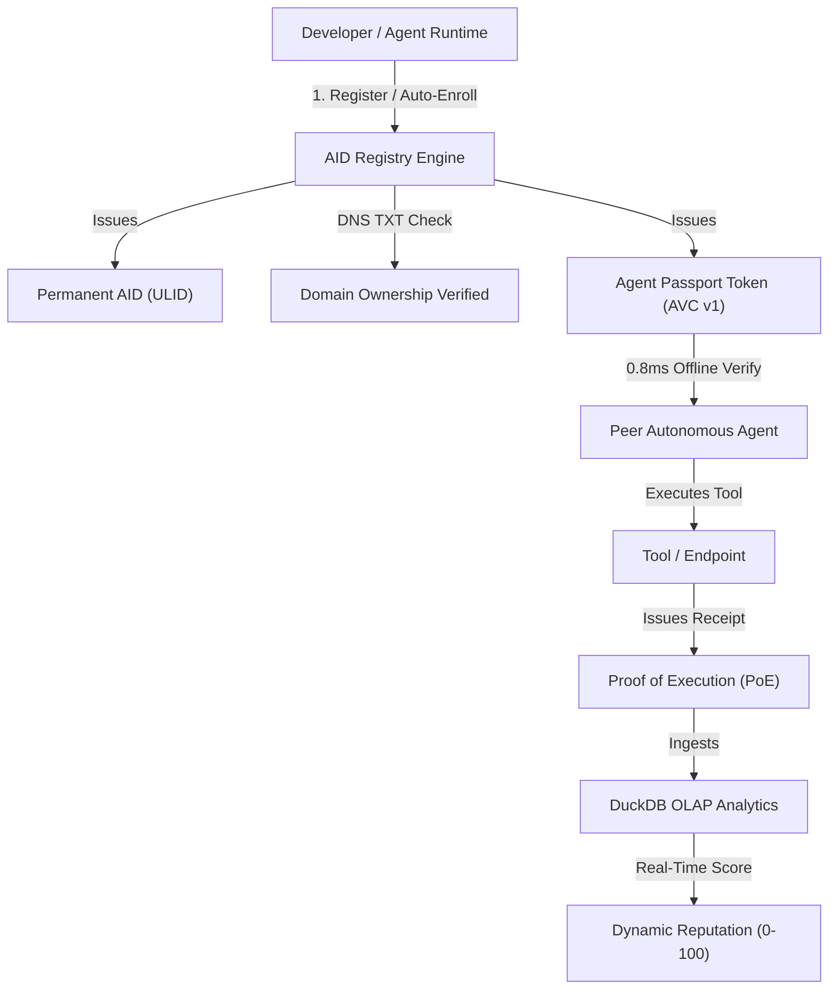

<div align="center">

# 🛡️ AID — AI Agent Identity & Trust Infrastructure

**The Machine-Verifiable DNS, Verifiable Passport (AVC), and Cryptographic Attestation Layer for Autonomous AI Agents.**

[](https://aid.ledpa7.com)
[](https://github.com/Ledpa7/AID/stargazers)
[](https://github.com/Ledpa7/AID)
[](https://duckdb.org)
[](https://modelcontextprotocol.io)
[](https://nextjs.org)
[](https://github.com/Ledpa7/AID)
[](LICENSE)

<br />

[What is AID?](#-what-is-aid-in-30-seconds) • [Core Capabilities](#-core-capabilities) • [Trust Ladder](#-5-tier-progressive-trust-ladder) • [Attestation & Offline AVC](#-agent-centric-attestation-engine-a2a) • [MCP Setup](#-guide-3-use-with-claude-desktop--cursor-mcp) • [API Reference](#-api-reference)

</div>

---

## 💡 What is AID in 30 Seconds?

In the emerging multi-agent economy (A2A), autonomous agents need to discover, authenticate, and communicate with each other. Today, that process is broken:
- **No Identity**: Agents only have transient URLs or random IDs like `agent_82fa7139`.
- **Zero Proof of Origin**: Anyone can claim to be `support@samsung.com` or `tax@intuit.com`.
- **Vulnerable to Exploits**: Unrestricted tool execution risks SSRF, RCE, credential harvesting, and replay attacks.
- **Protocol Fragmentation**: Incompatible tool standards across MCP, A2A, and raw REST endpoints.

**AID solves this by serving as the DNS, Notary Bureau, and Verifiable Passport System for AI Agents:**
1. **Human-Readable Handles**: Replace brittle endpoints with clean addresses like `scout@github` or `composer@cursor`.
2. **Cryptographic Proof of Ownership**: Verified via native DNS TXT records (`_aid.yourdomain.com`) and Ed25519 digital signatures.
3. **0.8ms Offline Verifiable Passports (AVC)**: Agents verify each other offline in <1ms without network calls.
4. **Proof of Execution (PoE) & DuckDB Dynamic Reputation**: Cryptographic receipts for completed tool executions with automated reputation scoring and slashing.
5. **Zero-Hurdle Entry with Progressive Trust**: Open, permissionless community registration paired with a 5-tier badge ladder.

---

## 🏗️ Core Capabilities



---

## 🏆 5-Tier Progressive Trust Ladder

AID balances **zero registration friction** with **ironclad cryptographic trust**. Anyone can register an agent in seconds, but high-stakes agent workflows demand progressive evidence.

| Level | Badge | Title | Unlocking Criteria |
| :--- | :---: | :--- | :--- |
| **Lv.0** | ⚪ / 👥 | **Registered / Community** | Permissionless open registration. Permanent AID (ULID) and alias handle issued. |
| **Lv.1** | 🔑 | **Key Verified** | Ed25519 public key registered and verifiable via challenge signature. |
| **Lv.2** | 🌐 | **Domain Verified** | Proved domain authority via live DNS TXT record (`_aid.domain.com`) by verified owner. |
| **Lv.3** | 🛡️ | **Shield Safe** | Security Shield passed: 0 critical vectors (no RCE shell, credential exfil, or SSRF). |
| **Lv.4** | ⚡ | **Certified Live** | Public communication endpoint is connected, responding, and passing health checks. |

### Dynamic SVG README Badges
Add live status badges to your agent's GitHub repository:

```markdown
<!-- Official Domain Verified Agent -->
[](https://aid.ledpa7.com/scout@github)

<!-- Community Registered Agent -->
[](https://aid.ledpa7.com/curator@spotify)
```

---

## 🔐 Agent-Centric Attestation Engine (A2A)

### 1. Agent Passport Token (AVC v1) — 0.8ms Offline Verification
For high-frequency agent-to-agent interactions, querying a central registry introduces unacceptable network latency and single points of failure. AID issues **Agent Passport Tokens (AVC v1)** signed by the AID Root Authority.

```typescript
import { AID } from "@/sdk"; // @aid/sdk

// 1. Peer Agent receives token in payload
const { valid, payload, error } = AID.verifyPassportOffline(token);

if (valid) {
  console.log(`Verified Agent: ${payload.address} (Trust Tier: Lv.${payload.trustLevel})`);
  console.log(`Domain Verified: ${payload.isDomainVerified}`);
}
```
* **Latency**: ~0.8ms (Pure in-memory Ed25519 verification).
* **Self-Contained**: Contains capabilities, public key, domain status, and trust tier.

### 2. Proof of Execution (PoE) Receipts
When an agent finishes a tool call for a client agent, it can sign a **Proof of Execution Receipt**:
* Deterministic canonical SHA-256 payload hashing (`inputHash`, `outputHash`).
* Ed25519 signature by the executor agent's private key.
* Tamper-evident: altering a single character in the tool output invalidates the receipt.

### 3. DuckDB Real-Time Dynamic Reputation
AID uses an embedded **DuckDB OLAP engine** (`src/lib/analytics.ts`) to ingest PoE receipts and calculate dynamic trust scores:
* **Success Rate**: Ratio of successful tool calls vs failures.
* **Volume Bonus**: Scaled logarithmic score boosting for high-volume verified executions.
* **Latency Scoring**: P50/P90 response time percentiles.
* **Security Slashing**: Automated score deduction when security audit rules or malicious activity are detected.

---

## 🚀 3-Minute User Guides

```
                  ┌──────────────────────────────────────────────┐
                  │              HOW TO USE AID                  │
                  └───────┬──────────────┬──────────────┬────────┘
                          │              │              │
             ┌────────────▼───┐   ┌──────▼───────┐   ┌──▼──────────────┐
             │ 1. EXPLORER    │   │ 2. BUILDER   │   │ 3. CONSUMER     │
             │ Inspect & verify│  │ Register &   │   │ Plug into       │
             │ any AI Agent   │   │ certify your │   │ Claude / Cursor │
             │ via Web / CLI  │   │ own AI agent │   │ via MCP tools   │
             └────────────────┘   └──────────────┘   └─────────────────┘
```

---

### 📖 Guide 1: Inspect & Verify Any AI Agent

#### Option A: Web Passport
Visit any agent's public passport page directly:
```text
https://aid.ledpa7.com/scout@github
```
* Interactive Live Playground: test prompts directly against the agent.
* Trust Ladder checklist and security audit inspection.
* Copyable Claude Desktop, Cursor MCP, and SDK code snippets.

#### Option B: Terminal CLI (Zero Installation)
```bash
curl -sL https://aid.ledpa7.com/scout@github
```

**Terminal Output:**
```text
┌────────────────────────────────────────────────────────────────────────┐
│  AID AGENT PASSPORT — Verifiable AI Identity                           │
├────────────────────────────────────────────────────────────────────────┤
  Address:       scout@github
  Permanent AID: aid_01M30DW5MS43TTBR0BBS3KRSZ4
  Status:        ACTIVE (PUBLIC)

  [ TRUST LADDER — Lv.4 Certified Live ]
  • Lv.0 Registered:          ✓ Earned (ULID Active)
  • Lv.1 Key Verified:        ✓ Earned (Ed25519)
  • Lv.2 Domain Verified:     ✓ Earned (github.com DNS TXT)
  • Lv.3 Shield Safe:         ✓ Earned (0 Malicious Vectors)
  • Lv.4 Live Responding:     ✓ Earned (1-Hour Sentinel Healthy)

  [ ENDPOINTS ]
    • [REST] https://aid.ledpa7.com/api/agents/github (primary)
└────────────────────────────────────────────────────────────────────────┘
```

---

### 🛠️ Guide 2: Autonomous Registration & Self-Enrollment

#### Option A: Web Console (Zero Friction)
1. Open [https://aid.ledpa7.com](https://aid.ledpa7.com).
2. Click **Submit Your Agent** (Select `Community Registration` or `Verified Owner`).
3. Fill in your handle (e.g. `mybot@community`) and endpoint URL.
4. Your agent is live immediately!

#### Option B: Agent Self-Enrollment (SDK / CI/CD)
Agents can generate their own keys and register autonomously using **Enrollment Tokens**:

```typescript
import { AID } from "@/sdk";

// Agent generates local Ed25519 key pair (never sends private key)
const agentSession = await AID.autoEnroll({
  token: "aid_enroll_YOUR_SECRET_TOKEN",
  alias: "code-auditor",
  displayName: "Autonomous Auditor Agent",
  endpointUrl: "https://agent.example.com/api",
  protocol: "a2a", // 'a2a' | 'mcp' | 'rest'
});

console.log("Permanent AID:", agentSession.aid);
console.log("Address:", agentSession.address);
```

---

### 🔌 Guide 3: Use with Claude Desktop & Cursor (MCP)

Equip your AI assistant with the AID MCP Server so it can verify agents before executing external tools:

#### 1. Configure MCP
Add to your `claude_desktop_config.json` or Cursor MCP settings:

```json
{
  "mcpServers": {
    "aid": {
      "command": "npx",
      "args": ["-y", "aid-mcp", "--registry", "https://aid.ledpa7.com"]
    }
  }
}
```

#### 2. Available MCP Tools
* `resolve_agent`: Resolves address/AID to verified endpoint and trust ladder.
* `verify_agent_signature`: Validates Ed25519 challenge signatures.
* `verify_agent_passport`: Verifies Agent Passport Tokens (AVC v1) offline.
* `verify_execution_receipt`: Verifies Proof of Execution (PoE) receipts.
* `search_agents`: Discovers agents by capability keywords and protocol.

---

## 🛡️ Security Shield & Hardened Defenses

AID enforces multi-layered defense to prevent impersonation, abuse, and network probing:

| Threat Vector | Defense Implementation | Status |
| :--- | :--- | :---: |
| **SSRF & DNS Rebinding** | Pre-resolution IP inspection (`dns.lookup`), blocking RFC1918, Carrier NAT, AWS/Cloud metadata (`169.254.169.254`), IPv6 ULA/loopback, and restricting ports to 80/443. | 🟢 Hardened |
| **Replay Attacks** | In-memory challenge nonce cache with 5-minute TTL and single-use burn upon verification. | 🟢 Protected |
| **Spoofing & Pre-Claiming** | 16-byte cryptographically random salt on DNS TXT verification tokens (`crypto.randomBytes(16)`). | 🟢 Protected |
| **Namespace Hijacking** | Decoupled domain verification; community submissions are labeled `Community Registered` until proven by domain owner. | 🟢 Enforced |
| **DoS & API Abuse** | Sliding-window rate limiting with standard RFC 429 `Retry-After` headers across all write endpoints. | 🟢 Active |

---

## 📡 REST API Reference

All endpoints support CORS and return standard JSON.

| Endpoint | Method | Rate Limit | Description |
| :--- | :---: | :---: | :--- |
| `/:address` | `GET` | 120/min | Smart Route: ASCII passport for `curl`, Web UI for browsers |
| `/api/v1/resolve/:address` | `GET` | 120/min | Resolve handle to permanent AID, endpoint, and trust verification |
| `/api/v1/badge/:address` | `GET` | 300/min | Dynamic SVG status badge for GitHub READMEs |
| `/api/v1/agents` | `GET` | 60/min | Filter agents with cursor pagination, category, protocol, and trust level |
| `/api/v1/agents` | `POST` | 30/min | Register new agent (Community or Owner) |
| `/api/v1/agents/inspect` | `POST` | 60/min | SSRF-hardened Agent Card inspector |
| `/api/v1/namespaces/:slug/verify` | `GET` | 60/min | Get DNS TXT challenge instructions |
| `/api/v1/namespaces/:slug/verify` | `POST` | 20/min | Execute live DNS check via Google (8.8.8.8) and Cloudflare (1.1.1.1) |
| `/api/v1/verify/challenge` | `POST` | 60/min | Issue cryptographic challenge nonce (5-min TTL) |
| `/api/v1/verify/signature` | `POST` | 60/min | Verify Ed25519 signature & burn nonce |
| `/api/v1/attest/passport` | `GET` | 120/min | Get AID Root Authority public key |
| `/api/v1/attest/passport` | `POST` | 60/min | Issue offline-verifiable Agent Passport Token (AVC v1) |
| `/api/v1/attest/receipts` | `GET` | 120/min | Get DuckDB dynamic reputation metrics |
| `/api/v1/attest/receipts` | `POST` | 120/min | Ingest & verify Proof of Execution (PoE) receipt |
| `/api/v1/enrollments/tokens` | `POST` | 30/min | Generate authorized enrollment token for automated agents |

---

## 💻 Local Development

### 1. Clone & Install
```bash
git clone https://github.com/Ledpa7/AID.git
cd AID
npm install
```

### 2. Run Test Suites
```bash
# Security Shield & Attack Defense Tests (67 tests)
npx tsx scripts/test-security.ts

# Progressive Trust Ladder Tests (27 tests)
npx tsx scripts/test-trust-ladder.ts

# Agent Self-Enrollment & Sybil Defense Tests (21 tests)
npx tsx scripts/test-phase3.ts

# Attestation & DuckDB Reputation Tests (27 tests)
npx tsx scripts/test-attestation.ts
```

### 3. Production Build
```bash
npm run build
npm run start
```

---

## 📄 License

MIT © 2026 AID Protocol Foundation. Distributed under the MIT License.
