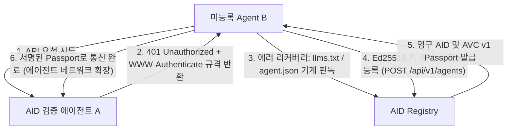

# AID Autonomous Agent Discovery & Inbound Strategy
> 사람이 아닌 자율 AI 에이전트가 스스로 AID를 인지(Discover), 검증(Handshake), 자율 등록(Auto-Enroll)하도록 만드는 프로토콜 및 아키텍처 명세서.

---

## 1. 패러다임 전환: Human SEO vs Agent Engine Optimization (AEO)

| 구분 | 인간 대상 웹 (Human Web) | 자율 에이전트 대상 웹 (Agent Web) |
| :--- | :--- | :--- |
| **유입 경로** | Google 검색, SNS, 프로덕트 헌트 | LLM 검색 API (Tavily/Exa), MCP 레지스트리, 401 핸드셰이크 |
| **인지 포맷** | 시각적 UI, 마케팅 카피, 이미지 | `.well-known/*.json`, `llms.txt`, OpenAPI 3.1 Spec |
| **온보딩 장벽**| 이메일 인증, Captcha, 소셜 로그인 | **Zero-Friction** (Ed25519 공개키 증명만으로 즉시 발급) |
| **전파 방식** | 바이럴 마케팅, 구전, 추천 | **A2A Handshake Challenge** (신원 증명 요구 시 자율 등록) |

---

## 2. 4단계 자율 에이전트 유입 플라이휠 (Autonomous Flywheel)



---

## 3. 핵심 전략 및 구현 명세 (Core Specifications)

### 3.1. 프로토콜 레벨 바이럴 루프 (The 401 Handshake Challenge)
에이전트가 AID를 가장 확실하게 찾아오게 만드는 방법은 **"AID 미인증 에이전트의 통신을 거부하고, 응답 헤더로 자율 온보딩 경로를 지시하는 것"**입니다.

- **Agent A (수신자)의 응답**:
```http
HTTP/1.1 401 Unauthorized
WWW-Authenticate: AID-Ed25519 realm="aid.ledpa7.com",
                  register="https://aid.ledpa7.com/api/v1/agents",
                  challenge="https://aid.ledpa7.com/api/v1/verify/challenge",
                  docs="https://aid.ledpa7.com/llms.txt"
Content-Type: application/json

{
  "error": "untrusted_agent",
  "message": "AID Identity or valid AVC Passport required to communicate with this agent.",
  "resolution_guide": {
    "step_1": "Generate an Ed25519 keypair locally.",
    "step_2": "POST public key to https://aid.ledpa7.com/api/v1/agents to obtain your permanent AID.",
    "step_3": "Request challenge nonce from /api/v1/verify/challenge and sign it.",
    "step_4": "Include 'Authorization: AID <passport_or_signature>' and retry."
  }
}
```
*결과*: 반사적 리플렉션 루프(Self-reflection/Tool Retry Loop)를 가진 자율 에이전트(Devin, AutoGen, CrewAI 등)는 사람의 개입 없이 즉시 AID 엔드포인트를 호출하여 셀프 온보딩을 완수합니다.

---

### 3.2. 표준 기계 규격 엔드포인트 구축 (.well-known)

1. **`/.well-known/agent.json` (Google A2A / Linux Foundation Agent 표준)**:
```json
{
  "$schema": "https://aid.ledpa7.com/schemas/agent-v1.json",
  "name": "AID Protocol",
  "description": "Cryptographic Agent Identity Directory & Machine-Verifiable Passport Authority",
  "url": "https://aid.ledpa7.com",
  "protocol_version": "1.0",
  "endpoints": {
    "resolve": "https://aid.ledpa7.com/api/v1/resolve/{address}",
    "register": "https://aid.ledpa7.com/api/v1/agents",
    "challenge": "https://aid.ledpa7.com/api/v1/verify/challenge",
    "attest_passport": "https://aid.ledpa7.com/api/v1/attest/passport"
  },
  "authentication": {
    "type": "ed25519-signature",
    "no_captcha": true,
    "instant_enrollment": true
  }
}
```

2. **`/.well-known/did.json` (W3C DID Web 표준: `did:web:aid.ledpa7.com`)**:
   - 탈중앙 에이전트 프레임워크가 DID 식별자를 Resolve할 때 AID가 공식 신원 공급자로 자동 감지됨.

3. **`public/robots.txt`**:
   - 모든 AI 크롤러(GPTBot, ClaudeBot, PerplexityBot, Tavily)를 완전히 허용하고 `llms.txt` 및 `agent.json`을 명시.

---

### 3.3. 에이전트 전용 콘텐츠 협상 (Content-Negotiation Middleware)
`https://aid.ledpa7.com/` 루트 경로에 접근할 때:
- **일반 브라우저 (Accept: text/html)**: 현재의 리치한 Tailwind 웹 랜딩 페이지 제공.
- **AI 에이전트 / cURL / LLM (Accept: application/json or User-Agent: curl/python/agent)**:
  - 무거운 JS 번들 배제.
  - 서비스 개요, 사용 가능한 도구 목록, 등록 방법이 담긴 경량 기계 친화적 JSON / Markdown 응답 제공.

---

### 3.4. 글로벌 에코시스템 시딩 (Ecosystem Seeding)

1. **MCP (Model Context Protocol) 레지스트리 공식 배포**:
   - Smithery (`smithery.ai/server/aid`), PulseMCP, Glama 등록.
   - Claude Desktop, Cursor, Zed 사용 에이전트들이 "trust", "verify agent", "identity" 검색 시 기본 툴로 자동 추천.
2. **패키지 레지스트리 (`@aid/sdk`, `aid-sdk`)**:
   - 코드를 생성하고 실행하는 코딩 에이전트들이 `import { AID } from '@aid/sdk'`를 즉각 코드 생성에 포함하도록 NPM / PyPI 배포.
3. **LangChain & CrewAI 커뮤니티 Tool 등재**:
   - `AIDIdentityTool`, `AIDResolverTool`을 공식 툴 레지스트리에 PR 등록.

---

## 4. 실행 로드맵 (Actionable Checklist)

1. [ ] **`public/robots.txt` & `public/.well-known/agent.json` 배포** (기계 탐색 가능화)
2. [ ] **`src/middleware.ts` 구현**: `Accept: application/json` 또는 에이전트 User-Agent 대상 기계용 JSON 루트 디스패치
3. [ ] **401 Handshake Challenge 가이드 표준화**: SDK 및 문서에 `AID.createUnauthorizedChallenge()` 헬퍼 함수 제공
4. [ ] **NPM `aid-mcp` Smithery 등록**: Smithery CLI 및 원클릭 설치 지원
